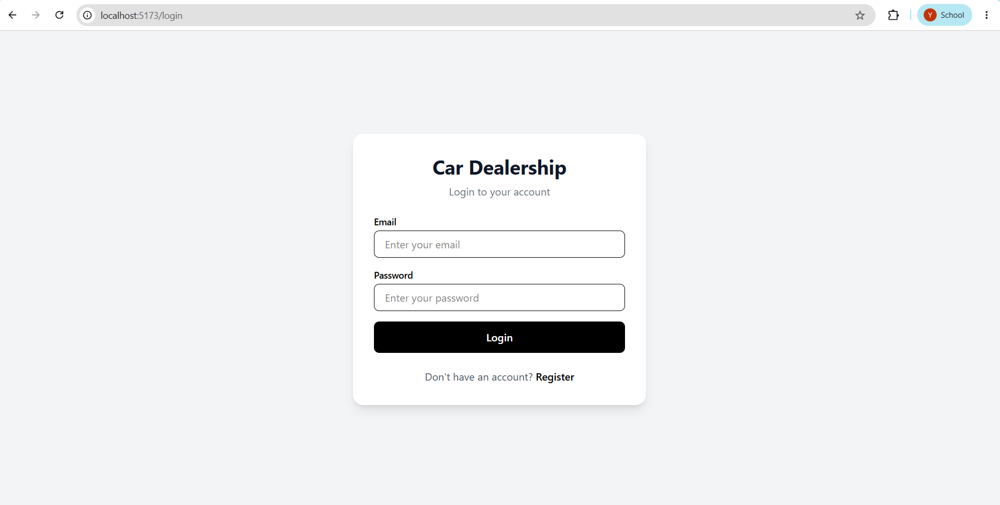
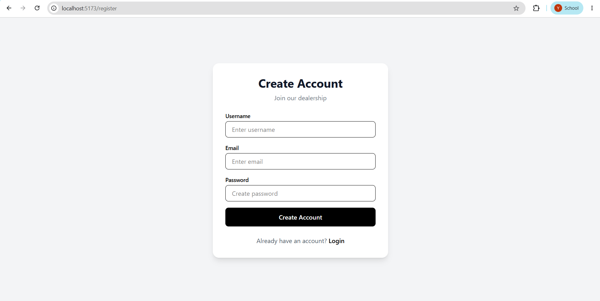
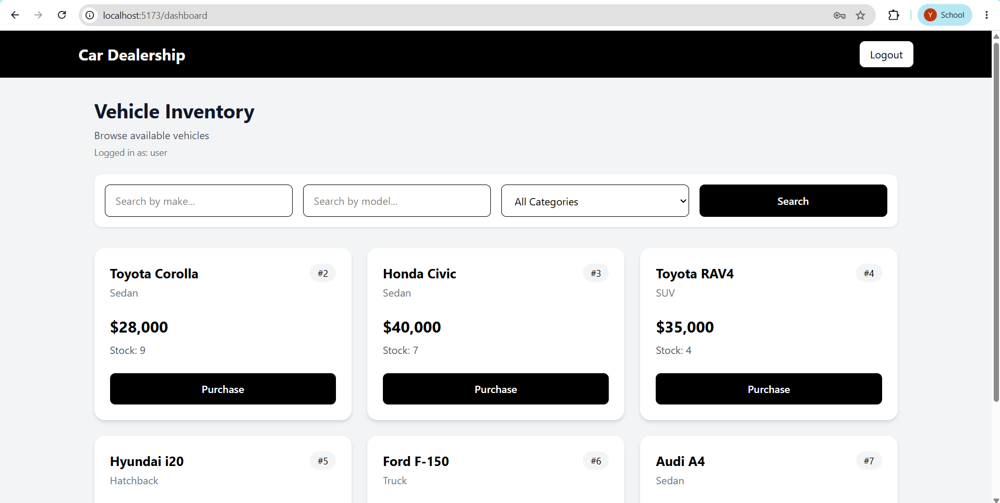
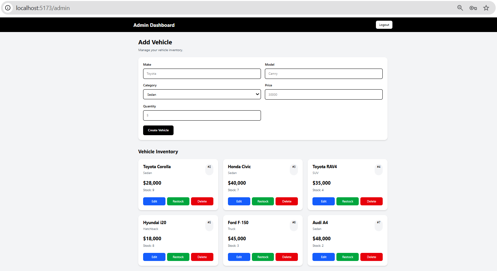
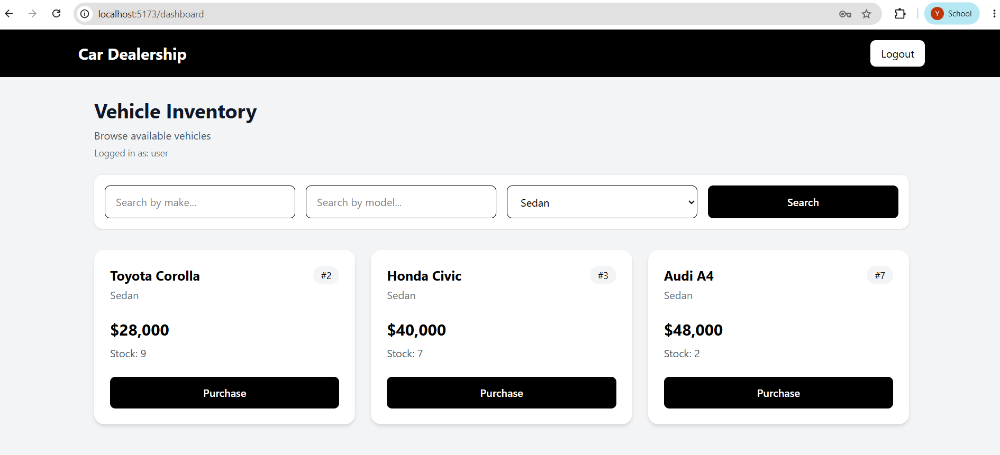
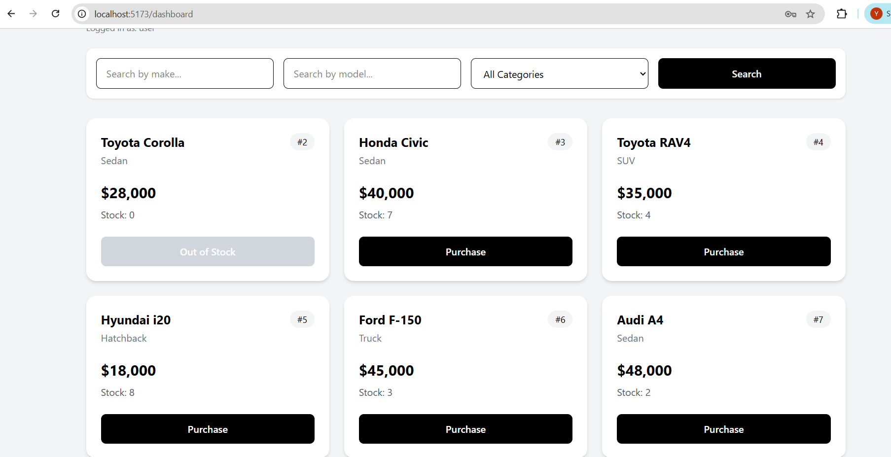
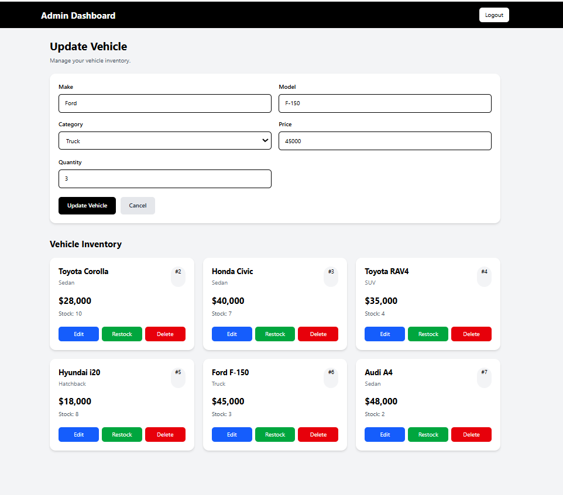
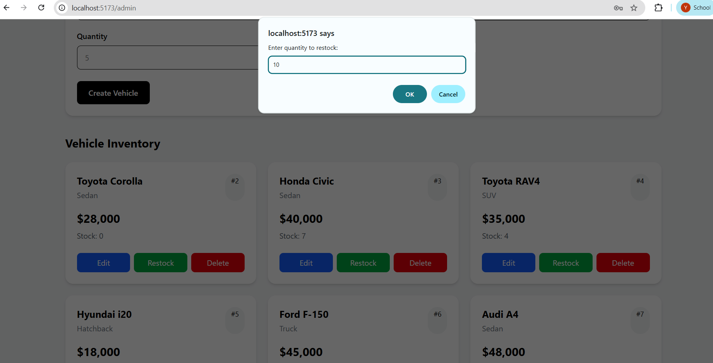
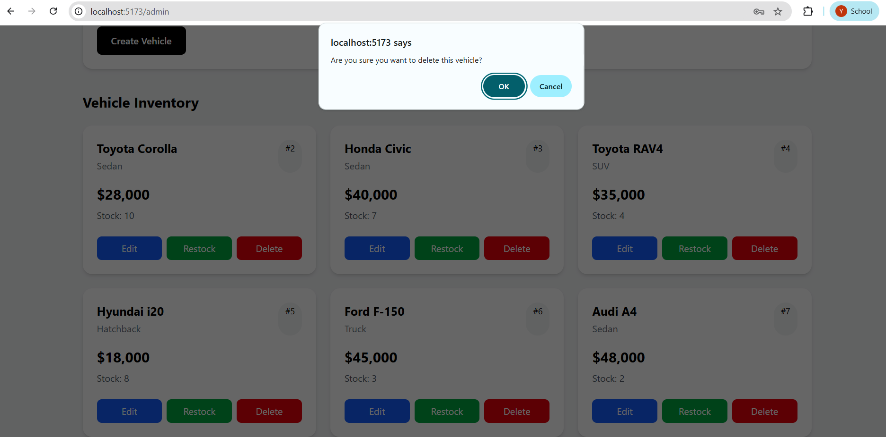

# Car Dealership Management System

A full-stack Car Dealership Inventory Management System built using FastAPI, React, SQLite, SQLAlchemy, JWT authentication, and Tailwind CSS.

The application supports two types of users:

- Regular users can browse, search, filter, and purchase vehicles.
- Administrators can add, update, delete, and restock vehicles.

The project follows REST API design, JWT-based authentication, role-based authorization, automated backend testing, and Git-based development practices.


## API Endpoints

### Authentication

| Method | Endpoint | Description |
|---|---|---|
| POST | `/api/auth/register` | Register a new user |
| POST | `/api/auth/login` | Login and receive JWT token |

### Vehicles

| Method | Endpoint | Access | Description |
|---|---|---|---|
| POST | `/api/vehicles` | Admin | Add a vehicle |
| GET | `/api/vehicles` | Authenticated users | View vehicles |
| GET | `/api/vehicles/search` | Authenticated users | Search/filter vehicles |
| PUT | `/api/vehicles/{id}` | Admin | Update vehicle |
| DELETE | `/api/vehicles/{id}` | Admin | Delete vehicle |
| POST | `/api/vehicles/{id}/purchase` | Authenticated users | Purchase vehicle |
| POST | `/api/vehicles/{id}/restock` | Admin | Restock vehicle |


## Testing

The backend uses Pytest for automated testing.

Tests cover:

- User registration
- User login
- JWT authentication
- Protected endpoints
- Role-based authorization
- Vehicle creation
- Vehicle retrieval
- Vehicle search
- Vehicle update
- Vehicle deletion
- Vehicle purchase
- Vehicle restocking

### Running Tests

```bash
cd backend
.venv\Scripts\activate
pytest
```

### Test Report

The complete test suite was executed successfully.
====================== test session starts ======================
platform win32 -- Python 3.14.2, pytest-9.1.1, pluggy-1.6.0
rootdir: C:\Users\yasuj\OneDrive\Desktop\car-dealership\backend
configfile: pytest.ini
testpaths: tests
collected 27 items

tests\test_auth.py .....                                   [ 18%]
tests\test_vehicles.py ......................              [100%]

======================= warnings summary ========================

StarletteDeprecationWarning:
Using httpx with starlette.testclient is deprecated;
install httpx2 instead.

================ 27 passed, 1 warning in 10.19s =================
### Test Result

27 tests passed successfully.


## Screenshots

### Login



### Registration



### User Dashboard



### Admin Dashboard



### Vehicle Search



### Vehicle Purchase



### Admin Edit



### Admin Restock



### Admin Delete

